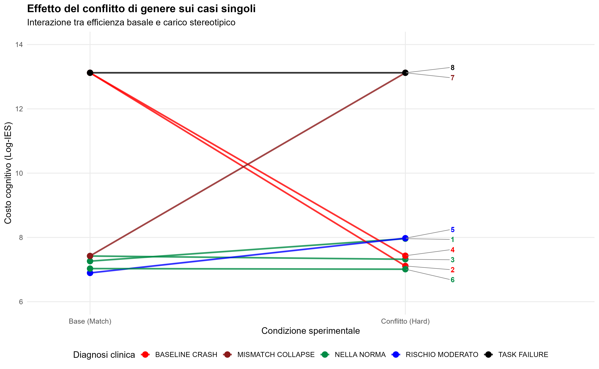
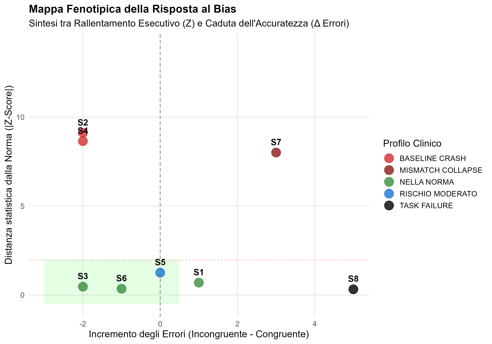
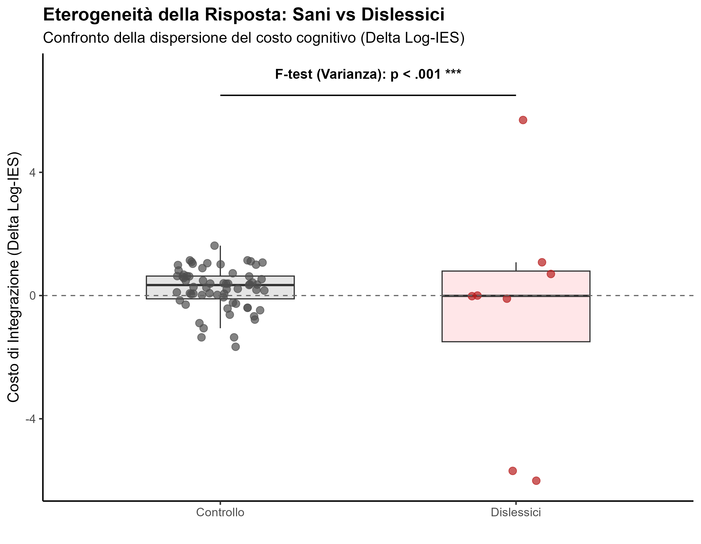

# Dyslexia-Clinical-Profiling
Statistical pipeline for clinical profiling of cognitive load in dyslexia. Features Crawford’s Test, IES normalization, and phenotypic mapping in R.

# Clinical Profiling of Stereotype-Driven Cognitive Load in Dyslexia

## Project Overview
This repository contains the statistical pipeline developed for my MA Thesis in **Data, Methods, and Models for Language Sciences**. The research investigates how social stereotypes act as a "cognitive barrier" for adults with **Developmental Dyslexia**, saturating their limited executive resources during morphosyntactic integration.

## Key Skills Demonstrated
- **Advanced Diagnostics:** Implementation of the **Crawford-Howell Test** for single-case vs. control group comparisons (N=67).
- **Metric Innovation:** Use of **Log-transformed Inverse Efficiency Score (IES)** to resolve speed-accuracy trade-offs in clinical populations.
- **Statistical Rigor:** Normality testing (Shapiro-Wilk, Q-Q Plots), outlier management, and effect size calculation (**Cohen’s d**).
- **Data Storytelling:** Creation of **Phenotypic Maps** to visualize individual "collapse points" during high-conflict linguistic tasks.

## Analysis Pipeline
The R script follows a modular logic:
1. **Normative Modeling:** Calculating population parameters from a sample of 67 neurotypical controls.
2. **Clinical Integration:** Processing reaction times (RT) and accuracy from 8 dyslexic participants across 4 experimental conditions (Match/Mismatch x Gender Bias).
3. **Single-Case Profiling:** Applying Crawford’s Test to define individual diagnostic categories: *Baseline Crash*, *Mismatch Collapse*, and *Task Failure*.
4. **Group Comparison:** Heterogeneity analysis via **Welch T-test** and **F-test** on variances to highlight the diverse cognitive strategies in dyslexia.

##  Privacy & Reproducibility
The datasets included (`data/`) are fully masked and anonymized (Masked ID, Mail & Location) to comply with ethical guidelines and GDPR, while maintaining the exact structure required to reproduce the statistical results.

---
**Author:** Chiara Mancuso  
**Thesis Supervisor:** Prof.ssa Gloria Gagliardi  
**University of Bologna** (Expected March 2026)

# The Socio-Cognitive Barrier: Clinical Profiling of Stereotype-Driven Load in Dyslexia

## Research Overview: Moving Beyond Group Averages
This project investigates the interaction between **reading automatization deficits** and the **supplementary cognitive load** imposed by gender stereotypes. The core innovation shifts the focus from general population trends to the **decomposition of individual variance** within the clinical group (Dyslexia).

By employing a multi-dimensional analytical framework, this pipeline identifies how sociolinguistic bias acts as a "cognitive bottleneck" that can lead to total functional breakdown in neurodivergent readers.

---

## Statistical Methodology
To manage the inherent variability of a clinical sample, the analysis integrates three key metrics:

1.  **Global Efficiency (Log-IES):** Integration of reaction times (RT) and accuracy to resolve speed-accuracy trade-offs.
    $$IES = \frac{RT}{ACC}$$
    *Applied with log-transformation to normalize distributions and handle "floor effects."*
2.  **Statistical Rarity (Crawford-Howell Test):** The elective tool for single-case analysis, comparing individual performance against a normative sample ($N=67$). It calculates a $Z_{Vero}$ that accounts for control group uncertainty.
3.  **Intra-Subject Magnitude (Cohen’s d):** Measuring the internal impact of the stereotype conflict regardless of the distance from the norm.

---

## Clinical Phenotypes: A Taxonomy of Resource Saturation
The analysis reveals that dyslexia is not a uniform slowing factor but a **stabilizing element** that makes the system hypersensitive to information load.

### 📑 Diagnostic Synthesis Table
| Participant | $Z_{Vero}$ | Clinical State | Effect Size ($d$) | Magnitude | Diagnostic Synthesis |
| :--- | :--- | :--- | :--- | :--- | :--- |
| **S7** | 8.02 | **MISMATCH COLLAPSE** | NA | **Collapse** | Selective collapse to social conflict |
| **S8** | -0.32 | **TASK FAILURE** | NA | **Collapse** | Systemic collapse (0% Accuracy) |
| **S2, S4** | < -8.5 | **BASELINE CRASH** | NA | **Crash** | Primary resource saturation |
| **S5** | 1.26 | **HIGH EFFORT** | 3.16 | **Large** | Maximum executive vulnerability |
| **S1** | 0.70 | **NORMAL RANGE** | 1.54 | **Large** | High-effort compensation |
| **S3, S6** | < 0 | **RESILIENT** | < 0.5 | **Small** | Compensated or resilient profile |

*Note: $Z_{Vero}$ = Individual Z-score; $d$ = Stereotypical effect size; NA indicates insufficient data for Cohen's d calculation due to ceiling/floor effects.*

---

## Key Findings: Qualitative Analysis of Resource Saturation

### The "Collapse" Phenotypes
* **Mismatch Collapse (e.g., S7):** Represents a selective vulnerability. The system is functional at baseline but "derails" specifically under the pressure of social conflict, where the stereotype acts as the final saturator of executive resources.
* **Task Failure (e.g., S8):** A catastrophic "floor effect." The $Z$-score near zero is a **statistical artifact**: the system is in total stall, making it impossible to measure further degradation. 0% accuracy confirms a complete failure of the morphosyntactic-semantic integration.
* **Baseline Crash (e.g., S2, S4):** "Primary saturation." Basic decoding exhausts 100% of resources, rendering the reader "blind" to the subsequent social bias. The negative Delta confirms that the effort to process a simple sentence already exceeds the system's capacity.

### 🟡 High-Effort Compensation
* **The S5 Case:** Despite a non-pathological $Z$-score (1.26), the massive effect size (**$d = 3.16$**) reveals a **paroxysmal investment of resources**. The subject preserves accuracy only by tripling their baseline temporal effort, reaching the limits of functional rupture.

### 🟢 Resilience & Noise Management
* **Resilient Profiles (S3, S6):** Demonstrates that social liability is a continuous variable. These subjects manage the stereotype interference as "background noise" without destabilizing the overall processing fluidity.

---

## Visual Evidence (`/plots`)

### 1. Individual Interaction Slope

*This chart highlights the "high effort" profiles: note how some slopes explode during the conflict condition, signaling the sudden sequestration of executive resources.*

### 2. 2D Phenotypic Map (Z-Score vs. Δ Errors)

*The final synthesis: mapping participants into different "danger zones," from the green area (Resilience) to the red quadrants (Systemic Collapse and Resource Saturation).*

### 3. Group Heterogeneity (F-Test)

*Statistical proof of the study's premise: the clinical group shows a significantly higher dispersion compared to the normative sample ($p < .001$), justifying the need for single-case profiling.*

---

## Conclusion: Inclusive Communication as Cognitive Accessibility
This study provides scientific evidence that **inclusive communication is a cognitive accessibility requirement**. Stereotypical bias is not merely a social preference but a **technical barrier** that can induce systemic collapse or extreme executive fatigue in neurodiverse populations.

---
**Author:** Chiara Mancuso  
**Academic Context:** MA in Data Science for Language  
**University:** Alma Mater Studiorum - Università di Bologna (2026)

